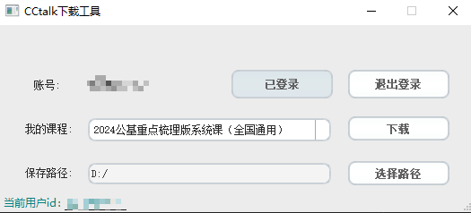
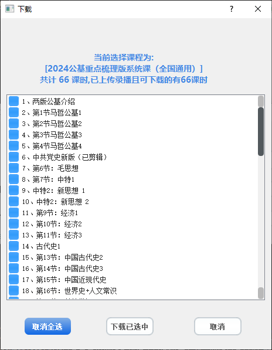
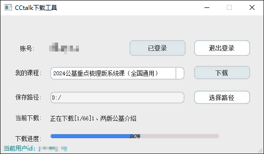

# CCtalk网课下载工具

PyQt+pyppeteer

友好GUI，傻瓜式操作，一键下载

仅客户端观看的课程流程会复制一些，工具暂无法直接支持，后面会整理处理方法出来。

**请勿用于商业用途，一切后果自行承担**

## 使用

点击登录会弹出浏览器进入cctalk官网，正常登录后程序会自动获取用户信息



我的课程是个下拉框，可以选择需要下载的课程，点击下载后会进一步解析课时列表，可按需选择需要下载的课程



支持进度显示，已存在文件会跳过下载，注意不会检查已存在文件的完整性




## 开发

python3环境即可，无特殊要求

```
pip install -r requirements.txt
python ccdownload.py
```


